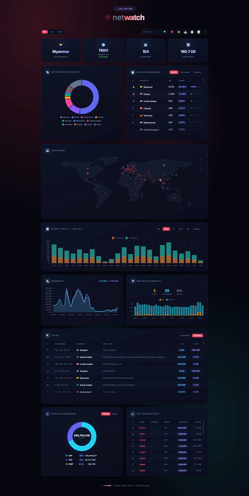

# netwatch

Lightweight, self-hosted network traffic monitor for Linux.



`netwatch` watches all network traffic on your machine, maps every public IP to its country and organization, and shows everything in a live browser dashboard. No cloud, no accounts, no subscriptions — runs entirely on your own hardware, even a Raspberry Pi.

---

## Table of Contents

- [What It Does](#what-it-does)
- [Key Features](#key-features)
- [Quick Start](#quick-start)
- [Dashboard](#dashboard)
- [Configuration](#configuration)
- [Authentication](#authentication)
- [API Endpoints](#api-endpoints)
- [Keyboard Shortcuts](#keyboard-shortcuts)
- [Data & Storage](#data--storage)
- [Traffic Direction](#traffic-direction)
- [Platform Requirements](#platform-requirements)
- [Troubleshooting](#troubleshooting)
- [Upstream Data](#upstream-data)
- [License](#license)

---

## What It Does

Once installed, `netwatch` silently monitors all IPv4 and IPv6 traffic on your machine and gives you a live picture of:

| Scope | What You See |
|-------|-------------|
| **Overview** | Total unique IPs, currently active IPs, total data transferred, countries seen |
| **Per country** | How many IPs, how much traffic (in/out), share percentage, hourly trends |
| **Per IP** | Country, organization (ASN), reputation tag, packets/bytes in both directions, first/last seen |
| **Per protocol** | TCP, UDP, ICMP, ICMPv6, GRE, etc. — with packet and byte counts |
| **Per port** | Most targeted inbound ports with service names (SSH, HTTP, RDP, etc.) |
| **Over time** | Live chart, plus 24h / 7d / 30d / all-time views and custom date ranges |
| **On a map** | Interactive world map with clickable traffic bubbles |

Everything stays on your machine. The only outbound connection is a daily geo-database refresh.

---

## Key Features

- **IPv4 + IPv6** — monitors both
- **Protocol & port stats** — see which protocols and ports are being hit
- **Country & ASN lookup** — every public IP is mapped to a country and organization, all done locally
- **Reputation badges** — known scanners (Shodan, Censys) and threat networks are flagged automatically
- **Real-time dashboard** — updates live in your browser, no page refresh needed
- **Country drilldown** — click any country to see every IP from that country
- **IP search** — look up any address to see its full history
- **Interactive world map** — zoomable map with traffic bubbles, click to drill down
- **Time ranges** — Live, 24h, 7d, 30d, All, or pick a custom date range
- **Direction filters** — filter by All / Incoming / Outgoing traffic
- **Live bandwidth** — rolling bits/sec and packets/sec display
- **New vs returning IPs** — per-interval breakdown with anomaly flag for scanning detection
- **Dark & light themes** — 5 colour palettes to choose from
- **Keyboard shortcuts** — press `?` in the dashboard for a full list
- **Data export** — CSV, JSON, or plain IP list for use in blocklists or other tools
- **Password-protected dashboard** — optional login page with brute-force protection
- **API key support** — access the API from scripts without a browser session
- **Auto-purge** — old data is automatically cleaned up (default: 90 days)
- **Disk-space protection** — pauses data writes if disk space runs low
- **Geo database auto-update** — refreshes every 24 hours, verifies downloads before applying
- **No dependencies** — single download, no Python/Node/Docker needed to run
- **Runs as a service** — starts on boot, restarts automatically on failure
- **Mobile friendly** — works as a home screen app on phones and tablets

---

## Quick Start

### 1. Download

Pick your architecture:

```bash
# Raspberry Pi 3/4/5, ARM servers (aarch64)
curl -L https://github.com/k-one-e/netwatch/releases/download/latest/netwatch-aarch64.tar.gz | tar xz
sudo mv netwatch /opt/netwatch

# Standard servers, desktops, VMs (x86_64)
curl -L https://github.com/k-one-e/netwatch/releases/download/latest/netwatch-x86_64.tar.gz | tar xz
sudo mv netwatch /opt/netwatch
```

### 2. Install

```bash
cd /opt/netwatch
sudo bash install.sh
```

This will:
1. Install `curl` if missing
2. Download GeoIP and ASN databases
3. Set up netwatch as a system service (auto-starts on boot)

### 3. Start

```bash
sudo systemctl start netwatch
```

### 4. Open the Dashboard

```
http://<your-ip>:8080/dashboard.html
```

Replace `<your-ip>` with your machine's IP address (e.g. `192.168.1.50`).

---

## Managing the Service

```bash
sudo systemctl start netwatch      # start
sudo systemctl stop netwatch       # stop
sudo systemctl restart netwatch    # restart
sudo systemctl status netwatch     # check if running
journalctl -u netwatch -f          # view live logs
```

### Running Without systemd

If your system doesn't use systemd, you can start netwatch manually:

```bash
cd /opt/netwatch
sudo bash run.sh            # default port 8080
sudo bash run.sh 9090       # custom port
```

### Uninstall

```bash
cd /opt/netwatch
sudo bash uninstall.sh
```

This stops the service, removes it from the system, and optionally deletes stored data. You can then delete `/opt/netwatch` to remove everything.

---

## Dashboard

### Overview Cards

Four cards at the top showing: **Top Country**, **Unique IPs** (with active count), **Countries**, and **Total Data**.

### Country Table

Ranked list of all countries sorted by traffic share, with a doughnut chart of the top 10. Click any country to drill down.

### Country Drilldown

Shows every IP from the selected country — IP address, organization, reputation badge, traffic in/out, and last seen. Paginated and sortable.

### World Map

Interactive map with traffic bubbles. Scroll to zoom, drag to pan, hover for details, click a bubble to drill down into that country.

### Protocol Chart

Horizontal bar chart of traffic by protocol (TCP, UDP, ICMP, etc.).

### Top Ports

Shows which inbound ports are being hit most, with service names (SSH, HTTP, HTTPS, RDP, MySQL, etc.).

### Traffic Over Time

Bar chart of incoming vs outgoing traffic. Choose Live, 24h, 7d, 30d, All, or a custom date range.

### Top IPs

The highest-traffic IPs with country, organization, and reputation badges.

### IP Search

Search for any IPv4 or IPv6 address to see its full details.

### Toolbar

| Control | Description |
|---------|-------------|
| Direction filter | All / ↓ In / ↑ Out |
| Search box | IPv4 or IPv6 lookup |
| Palette picker | 5 colour themes |
| ☀️ / 🌙 | Dark / light mode |
| 📥 | Export CSV |
| 📋 | Export JSON |
| 📝 | Export IP list |
| ⌨ | Keyboard shortcuts |

---

## Configuration

Edit `/opt/netwatch/config.json`:

```json
{
  "port": 8080,
  "interval": 30,
  "iface": "",
  "retention_days": 90,
  "disk_warn_mb": 100,
  "auth_user": "",
  "auth_hash": "",
  "auth_api_key": "",
  "session_hours": 72
}
```

| Setting | Default | Description |
|---------|---------|-------------|
| `port` | `8080` | HTTP server port for the dashboard |
| `interval` | `30` | How often the dashboard updates (seconds) |
| `iface` | `""` (all) | Network interface to monitor (e.g. `"eth0"`, `"wlan0"`) |
| `retention_days` | `90` | Delete data older than this many days (0 = keep forever) |
| `disk_warn_mb` | `100` | Pause data collection when free disk space drops below this (MB) |
| `auth_user` | `""` | Username for dashboard login (empty = no login required) |
| `auth_hash` | `""` | Password hash — generate with `./netwatch --hash-password` |
| `auth_api_key` | `""` | Optional API key for script/automation access |
| `session_hours` | `72` | How long a login session lasts (hours) |

After changing the config, restart the service:

```bash
sudo systemctl restart netwatch
```

---

## Authentication

By default, the dashboard is open — anyone who can reach the port can view it. To add a login page:

### 1. Generate a password hash

```bash
cd /opt/netwatch
./netwatch --hash-password "your-password"
```

This prints a hash like `$2a$10$...` — copy it.

### 2. Edit `config.json`

```json
{
  "auth_user": "admin",
  "auth_hash": "$2a$10$xxxxxxxxxxxxxxxxxxxxxxxxxxxxxxxxxxxxxxxxxxxxxxxxxxxxx",
  "auth_api_key": "",
  "session_hours": 72
}
```

### 3. Restart

```bash
sudo systemctl restart netwatch
```

Now visiting the dashboard shows a login page. After signing in, your session lasts 72 hours (configurable).

### API key (optional)

If you want scripts or tools to access the API without logging in through a browser, set `auth_api_key` to any secret string, then pass it in requests:

```bash
curl -H "Authorization: Bearer your-api-key" http://host:8080/stats.json
curl -H "X-API-Key: your-api-key" http://host:8080/export/json
```

### Brute-force protection

After 10 failed login attempts from the same IP within 5 minutes, further attempts are temporarily blocked.

### Disabling authentication

To go back to open access, remove or empty `auth_user` and `auth_hash` in `config.json` and restart.

---

For automation or custom integrations, netwatch exposes a simple HTTP API:

| Endpoint | Description |
|----------|-------------|
| `/login` | Login page (only when authentication is enabled) |
| `/logout` | Sign out and return to login page |
| `/dashboard.html` | Dashboard UI |
| `/hourly?from=YYYY-MM-DD&to=YYYY-MM-DD` | Hourly traffic data for a date range |
| `/daily` | Daily traffic totals |
| `/country?code=US` | All IPs from a specific country |
| `/search?ip=1.2.3.4` | Look up a specific IP address |
| `/protocols` | Protocol breakdown |
| `/ports` | Top targeted ports |
| `/export/json` | Full dataset as JSON |
| `/export/ips` | All seen IPs, one per line (useful for blocklists) |

---

## Keyboard Shortcuts

Press `?` in the dashboard to see all shortcuts. Highlights:

| Key | Action |
|-----|--------|
| `D` | Switch direction: All → In → Out |
| `M` | Switch metric: IPs → Packets → Bytes |
| `T` | Toggle dark / light mode |
| `/` | Jump to search box |
| `E` | Export CSV |
| `Esc` | Close panels |

---

## Data & Storage

All data is stored inside the install directory:

```
/opt/netwatch/
├── data/
│   ├── db/       # Database
│   ├── mmdb/     # GeoIP databases (auto-updated)
│   └── output/   # Live data
├── config.json   # Your settings
├── dashboard.html
└── ...
```

Data older than the configured retention period (default: 90 days) is automatically cleaned up. Set `retention_days` to `0` to keep data indefinitely.

---

## Traffic Direction

- **Incoming** — traffic from a public IP sent to your machine
- **Outgoing** — traffic from your machine sent to a public IP

Only public IPs are tracked. Private networks, localhost, and reserved ranges are automatically excluded.

---

## Platform Requirements

- **Linux only** — macOS and Windows are not supported
- **Architectures:** `aarch64` (Raspberry Pi 3/4/5, ARM servers) and `x86_64`
- **Dependencies:** `bash` and `curl` (auto-installed if missing)

---

## Troubleshooting

### No traffic in the dashboard

- Make sure you're on Linux
- Make sure the machine has network traffic
- Check that GeoIP databases exist: `ls /opt/netwatch/data/mmdb/`

### Missing ASN / organization data

The ASN database may not have downloaded. Delete and reinstall:
```bash
sudo rm /opt/netwatch/data/mmdb/asn.mmdb
sudo bash /opt/netwatch/install.sh
```

### Dashboard stops updating

Refresh the page. If it persists, check the logs:
```bash
journalctl -u netwatch --since "5 min ago"
```

### GeoIP database errors

Delete the corrupted file and reinstall:
```bash
sudo rm /opt/netwatch/data/mmdb/country.mmdb
sudo bash /opt/netwatch/install.sh
```

---

## Upstream Data

GeoIP databases are provided by [`sapics/ip-location-db`](https://github.com/sapics/ip-location-db). See that project for data licensing details.

---

## License

Proprietary — free for personal and non-commercial use. See [LICENSE](LICENSE).
